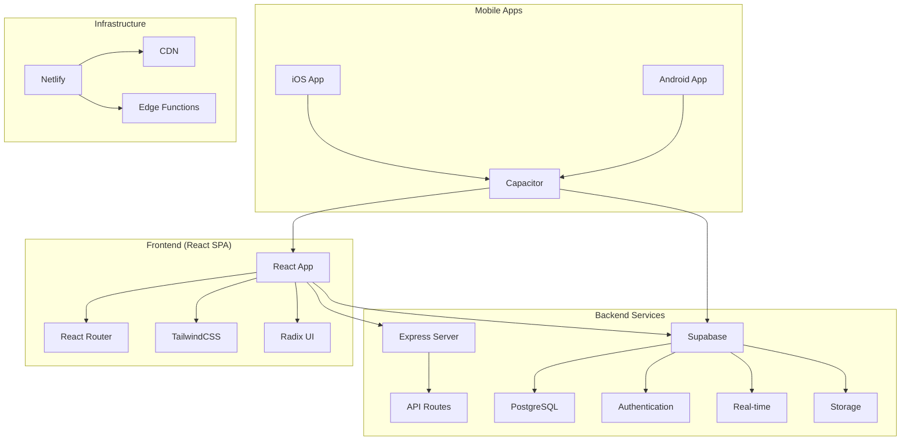

# ��️ AirPlus Aviation Management System

<div align="center">


**Sistema de Gestão Aeroportuária Completo**

[](package.json)
[](https://www.typescriptlang.org/)
[](https://reactjs.org/)
[](https://supabase.com/)
[](https://capacitorjs.com/)
[](LICENSE)

[Demo](https://airplus-aviation.netlify.app) • [Documentação](docs/) • [API Reference](docs/api.md) • [Mobile Apps](docs/mobile/MOBILE_APPS_STATUS.md)

</div>

## 📋 Índice

- [🎯 Visão Geral](#-visão-geral)
- [✨ Características](#-características)
- [🏗️ Arquitetura](#️-arquitetura)
- [📱 Tecnologias](#-tecnologias)
- [🚀 Instalação](#-instalação)
- [⚙�� Configuração](#️-configuração)
- [🛠️ Desenvolvimento](#️-desenvolvimento)
- [📱 Mobile Apps](#-mobile-apps)
- [🌐 Deploy](#-deploy)
- [📊 Base de Dados](#-base-de-dados)
- [🔒 Segurança](#-segurança)
- [📚 Documentação](#-documentação)
- [🤝 Contribuição](#-contribuição)
- [📄 Licença](#-licença)

## 🎯 Visão Geral

O **AirPlus Aviation Management System** é uma solução completa de gestão aeroportuária desenvolvida especificamente para operações de aviação comercial e privada em Angola. O sistema oferece gestão integrada de aeronaves, funcionários, tarefas de manutenção, formulários de limpeza e operações de voo.

### 🌟 Principais Funcionalidades

- **Gestão de Aeronaves** - Controle completo da frota
- **Gestão de Funcionários** - Sistema de RH integrado
- **Formulários de Limpeza** - Processo digitalizado de higienização
- **Fichas de Voo** - Registo e acompanhamento de voos
- **Sistema de Tarefas** - Gestão de manutenção e operações
- **Dashboard Analytics** - Métricas e relatórios em tempo real
- **Modo Offline** - Funcionamento sem internet
- **Apps Mobile** - iOS e Android nativos
- **Multi-utilizador** - Sistema de roles e permissões

## ✨ Características

### 🔧 Funcionais

- ✅ **Gestão Completa de Aeronaves** - CRUD completo com histórico
- ✅ **Sistema de Funcionários** - 14 funcionários específicos de Angola
- ✅ **Formulários Digitais** - Limpeza, manutenção e inspeção
- ✅ **Dashboard em Tempo Real** - Métricas operacionais
- ✅ **Sistema de Roles** - 8 níveis hierárquicos
- ✅ **Auditoria Completa** - Log de todas as atividades
- ✅ **Exportação de Dados** - PDF, Excel, CSV
- ✅ **Sincronização Offline** - Dados persistem sem internet

### 🚀 Técnicas

- ✅ **Progressive Web App (PWA)** - Instalável e offline
- ✅ **Responsive Design** - Otimizado para todos os dispositivos
- ✅ **Real-time Updates** - Websockets para atualizações live
- ✅ **TypeScript** - Tipagem forte em todo o código
- ✅ **Modern UI/UX** - Interface glassmorphism com TailwindCSS
- ✅ **Performance Otimizada** - Bundle splitting e lazy loading
- ✅ **SEO Friendly** - Meta tags e structured data
- ✅ **Accessibility (a11y)** - WCAG 2.1 compliance

## 🏗️ Arquitetura



### 📁 Estrutura do Projeto

```
airplus-aviation/
├── 📱 client/                   # Frontend React SPA
│   ├── components/              # Componentes reutilizáveis
│   │   ├── ui/                 # Sistema de design (48 componentes)
│   │   ├── dashboards/         # Dashboards por role
│   │   └── ...                 # Componentes específicos
│   ├── pages/                  # Páginas da aplicação
│   ├── hooks/                  # Custom React hooks
│   ├── lib/                    # Utilitários e serviços
│   └── global.css              # Estilos globais + TailwindCSS
├── 🔧 server/                  # Backend Express
│   ├── routes/                 # Endpoints da API
│   └── index.ts               # Configuração do servidor
├── 📊 shared/                  # Tipos partilhados
├── 📱 ios/                     # App iOS nativo
├─�� 🤖 android/                 # App Android nativo
├── 🗄️ supabase/                # Database & Auth
│   ├── migrations/             # Schema da base de dados
│   └── config.toml            # Configuração Supabase
├── 🚀 scripts/                 # Scripts de deploy e automação
├── 📊 data/                    # Dados de demonstração
├── 🌐 netlify/                 # Funções serverless
└── 📚 docs/                    # Documentação
```

## 📱 Tecnologias

### Frontend Stack

| Tecnologia        | Versão  | Propósito               |
| ----------------- | ------- | ----------------------- |
| **React**         | 18.3.1  | Framework principal     |
| **TypeScript**    | 5.5.3   | Tipagem estática        |
| **Vite**          | 6.2.2   | Build tool e dev server |
| **React Router**  | 6.26.2  | Routing SPA             |
| **TailwindCSS**   | 3.4.11  | Framework CSS           |
| **Radix UI**      | Latest  | Componentes acessíveis  |
| **Framer Motion** | 12.6.2  | Animações               |
| **Lucide React**  | 0.462.0 | Ícones                  |

### Backend Stack

| Tecnologia     | Versão | Propósito              |
| -------------- | ------ | ---------------------- |
| **Node.js**    | 18+    | Runtime JavaScript     |
| **Express**    | 4.18.2 | Framework web          |
| **Supabase**   | 2.53.0 | BaaS (Database + Auth) |
| **PostgreSQL** | 15+    | Base de dados          |
| **Zod**        | 3.23.8 | Validação de dados     |

### Mobile Stack

| Tecnologia    | Versão  | Propósito         |
| ------------- | ------- | ----------------- |
| **Capacitor** | 7.4.2   | Framework híbrido |
| **iOS**       | 14.0+   | Plataforma Apple  |
| **Android**   | API 24+ | Plataforma Google |

### DevOps & Deploy

| Tecnologia            | Versão | Propósito            |
| --------------------- | ------ | -------------------- |
| **Netlify**           | Latest | Hosting e CI/CD      |
| **Netlify Functions** | Latest | Serverless           |
| **Vitest**            | 3.1.4  | Framework de testes  |
| **ESLint + Prettier** | Latest | Linting e formatação |

## 🚀 Instalação

### Pré-requisitos

- **Node.js** 18.0 ou superior
- **npm** 9.0 ou superior
- **Git** para controlo de versão
- **Supabase CLI** (opcional, para desenvolvimento local)

### 1. Clone o Repositório

```bash
git clone https://github.com/airplus/aviation-management.git
cd aviation-management
```

### 2. Instalar Dependências

```bash
npm install
```

### 3. Configurar Variáveis de Ambiente

```bash
cp .env.example .env
```

Edite o arquivo `.env` com suas configurações:

```env
# Supabase Configuration
VITE_SUPABASE_URL=https://your-project.supabase.co
VITE_SUPABASE_ANON_KEY=your-anon-key

# Application Configuration
VITE_APP_NAME=AirPlus Aviation
VITE_APP_VERSION=1.0.0
VITE_APP_ENVIRONMENT=development

# Features
VITE_ENABLE_DEMO_MODE=true
VITE_ENABLE_OFFLINE_MODE=true
VITE_ENABLE_ANALYTICS=false
```

### 4. Iniciar o Servidor de Desenvolvimento

```bash
npm run dev
```

A aplicação estará disponível em `http://localhost:8080`

## ⚙️ Configuração

### Configuração da Base de Dados

1. **Criar projeto no Supabase**:

   ```bash
   # Fazer login no Supabase
   npx supabase login

   # Conectar ao projeto
   npx supabase link --project-ref your-project-id
   ```

2. **Executar migrations**:

   ```bash
   npx supabase db push
   ```

3. **Verificar configuração**:
   ```bash
   npm run verify:system
   ```

### Configuração Mobile

Para desenvolvimento mobile, veja: [BUILD_MOBILE_APPS.md](BUILD_MOBILE_APPS.md)

## 🛠️ Desenvolvimento

### Scripts Disponíveis

```bash
# Desenvolvimento
npm run dev              # Iniciar servidor de desenvolvimento
npm run dev:staging      # Ambiente de staging
npm run dev:production   # Ambiente de produção

# Build
npm run build            # Build completo (client + server)
npm run build:client     # Build apenas do frontend
npm run build:server     # Build apenas do backend

# Testes
npm test                 # Executar testes
npm run typecheck        # Verificação de tipos TypeScript

# Mobile
npm run build:mobile     # Build para mobile
npm run mobile:android   # Abrir projeto Android
npm run mobile:ios       # Abrir projeto iOS

# Database
npm run db:start         # Iniciar Supabase local
npm run db:reset         # Reset da base de dados
npm run db:push          # Push migrations
npm run db:deploy        # Deploy para produção

# Utilidades
npm run format.fix       # Formatar código
npm run verify:system    # Verificar sistema completo
```

### Estrutura de Desenvolvimento

#### Adicionar Nova Página

1. Criar componente em `client/pages/MinhaPage.tsx`
2. Adicionar rota em `client/App.tsx`:
   ```typescript
   <Route path="/minha-page" element={<MinhaPage />} />
   ```

#### Adicionar Nova API Route

1. Criar handler em `server/routes/minha-route.ts`
2. Registrar em `server/index.ts`:
   ```typescript
   app.get("/api/minha-rota", handleMinhaRota);
   ```

#### Adicionar Novo Componente UI

1. Criar em `client/components/ui/meu-componente.tsx`
2. Exportar em `client/components/ui/index.ts`
3. Usar em qualquer parte da aplicação

### Guidelines de Código

- **TypeScript**: Sempre usar tipagem forte
- **Componentes**: Functional components com hooks
- **Estilos**: TailwindCSS utility-first
- **Estado**: React hooks + Context API
- **Formulários**: React Hook Form + Zod validation
- **Testes**: Vitest + Testing Library

## 📱 Mobile Apps

### Status Atual

- ✅ **iOS App**: Pronta para deploy na App Store
- ✅ **Android App**: Pronta para deploy no Google Play
- ✅ **Capacitor**: Configurado e funcional
- ✅ **Plugins**: Camera, Storage, Network, Device

### Build Mobile

```bash
# Build e sincronizar
npm run build:mobile

# Abrir projetos nativos
npm run mobile:ios      # Xcode
npm run mobile:android  # Android Studio

# Build para stores
npm run build:ios       # Build iOS
npm run build:android   # Build Android
```

Para mais detalhes: [MOBILE_APPS_STATUS.md](MOBILE_APPS_STATUS.md)

## 🌐 Deploy

### Netlify (Recomendado)

```bash
# Via CLI
npm run build
netlify deploy --prod

# Via Git (automático)
git push origin main
```

### Deploy Manual

```bash
# Build de produção
npm run build:production

# Iniciar servidor
npm start
```

### Variáveis de Produção

Configure no Netlify ou seu provedor:

```env
VITE_SUPABASE_URL=https://your-prod-project.supabase.co
VITE_SUPABASE_ANON_KEY=your-prod-anon-key
VITE_APP_ENVIRONMENT=production
VITE_ENABLE_DEMO_MODE=false
VITE_ENABLE_ANALYTICS=true
```

## 📊 Base de Dados

### Schema Completo

O sistema utiliza **16 tabelas** no PostgreSQL via Supabase:

#### Operacionais

- `aircraft` - Gestão da frota (4 aeronaves)
- `employees` - Funcionários (14 específicos de Angola)
- `tasks` - Tarefas de manutenção
- `flight_sheets` - Fichas de voo
- `cleaning_forms` - Formulários de limpeza
- `cleaning_form_employees` - Relação funcionários/limpeza
- `system_settings` - Configurações do sistema
- `file_attachments` - Anexos e documentos

#### Autenticação & Autorização

- `roles` - 8 roles hierárquicas
- `permissions` - 40+ permissões granulares
- `role_permissions` - Relação roles/permissões
- `user_profiles` - Perfis estendidos
- `user_roles` - Atribuição de roles
- `user_activity_log` - Log de atividades
- `user_sessions` - Gestão de sessões
- `password_reset_tokens` - Reset de passwords

### Dados de Demonstração

- **4 Aeronaves**: PT-ABC, PT-XYZ, PT-DEF, PT-GHI
- **14 Funcionários**: Dados reais de Angola
- **8 Roles**: Super Admin → Viewer
- **100+ Registos**: Distribuídos em todas as tabelas

Para mais detalhes: [supabase/README.md](supabase/README.md)

## 🔒 Segurança

### Autenticação

- **Supabase Auth** - Sistema robusto de autenticação
- **JWT Tokens** - Segurança baseada em tokens
- **Row Level Security (RLS)** - Acesso granular a dados
- **Multi-factor Authentication** - 2FA opcional

### Autorização

- **Role-based Access Control (RBAC)** - 8 níveis de acesso
- **Permission-based** - 40+ permissões específicas
- **Resource-level Security** - Controlo por recurso
- **Audit Trail** - Log completo de atividades

### Dados

- **Encriptação** - Dados sensíveis encriptados
- **Backup Automático** - Supabase backup diário
- **GDPR Compliance** - Conformidade com proteção de dados
- **Secure Headers** - Headers de segurança HTTP

## 📚 Documentação

### Centro de Documentação Organizado

A documentação completa está organizada em **[docs/](docs/)** com estrutura lógica:

```
docs/
├── 📖 README.md              # Índice principal da documentação
├── 🚀 deploy/                # Guias de deploy e produção
├── 📱 mobile/                # Documentação mobile iOS/Android
├── 🗄️ database/              # Documentação base de dados
├── 🛠️ development/           # Guias técnicos de desenvolvimento
└── 📜 legacy/                # Documentação histórica
```

### 🎯 Links Essenciais

#### 📖 **Documentação Principal**
- [📚 **Centro de Documentação**](docs/) - **← COMEÇAR AQUI**
- [🎨 Frontend (React SPA)](client/README.md)
- [🔧 Backend (Express API)](server/README.md)
- [📱 Mobile (iOS/Android)](mobile/README.md)
- [🗄️ Base de Dados (Supabase)](supabase/README.md)
- [🚀 Scripts de Automação](scripts/README.md)

#### 🚀 **Deploy e Produção**
- [🚀 Guia de Deploy](docs/deploy/AIRPLUS_DEPLOY_GUIDE.md)
- [🗄️ Deploy Supabase](docs/deploy/SUPABASE_DEPLOY.md)
- [📊 Resumo Produção](docs/production/AIRPLUS_PRODUCTION_SUMMARY.md)

#### 🛠️ **Desenvolvimento**
- [👥 Guia Técnico Completo](docs/development/AGENTS.md)
- [🔒 Segurança](docs/development/SECURITY.md)
- [📋 Plano 50 Migrations](supabase/MIGRATION_PLAN.md)
- [✅ Relatório Integridade Final](supabase/FINAL_SYSTEM_INTEGRITY_REPORT.md)

#### 📱 **Mobile e Apps**
- [🏗️ Build Mobile Apps](docs/mobile/BUILD_MOBILE_APPS.md)
- [📱 Status Apps](docs/mobile/MOBILE_APPS_STATUS.md)
- [📱 Compatibilidade Mobile](supabase/MOBILE_COMPATIBILITY_VALIDATION.md)

## 🤝 Contribuição

### Como Contribuir

1. **Fork** o projeto
2. **Clone** seu fork
3. **Criar branch** para sua feature
4. **Implementar** mudanças
5. **Testar** completamente
6. **Commit** com mensagens descritivas
7. **Push** para seu fork
8. **Abrir Pull Request**

### Guidelines

- **Código**: Seguir padrões TypeScript/React
- **Commits**: Conventional Commits format
- **Testes**: Adicionar testes para novas features
- **Docs**: Atualizar documentação relevante
- **Style**: Usar Prettier + ESLint

### Estrutura de Commits

```
feat(scope): descrição breve

Descrição detalhada do que foi implementado.

Closes #123
```

## 📄 Licença

MIT License - veja [LICENSE](LICENSE) para detalhes.

---

<div align="center">

**🛩️ AirPlus Aviation Management System**

_Desenvolvido com ❤️ para a aviação Angolana_

[Website](https://airplus-aviation.netlify.app) • [GitHub](https://github.com/airplus/aviation-management) • [Documentation](docs/) • [Support](mailto:support@airplus.ao)

</div>
