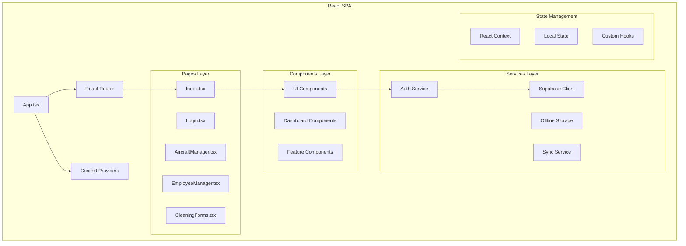

# 🎨 Frontend - AirPlus Aviation

<div align="center">

**Interface de Utilizador Moderna e Responsiva**

[](https://reactjs.org/)
[](https://www.typescriptlang.org/)
[](https://tailwindcss.com/)
[](https://vitejs.dev/)

</div>

## 📋 Índice

- [🎯 Visão Geral](#-visão-geral)
- [🏗️ Arquitetura](#️-arquitetura)
- [📁 Estrutura](#-estrutura)
- [🧩 Componentes](#-componentes)
- [📱 Pages](#-pages)
- [🎨 Design System](#-design-system)
- [📦 Hooks Customizados](#-hooks-customizados)
- [⚙️ Serviços](#️-serviços)
- [🛠️ Desenvolvimento](#️-desenvolvimento)
- [📱 Mobile-First](#-mobile-first)
- [♿ Acessibilidade](#-acessibilidade)

## 🎯 Visão Geral

O frontend é uma **Single Page Application (SPA)** construída com React 18, TypeScript e TailwindCSS. Oferece uma experiência moderna, responsiva e acessível para gestão aeroportuária.

### ✨ Características Principais

- **🎨 Design Glassmorphism** - Interface moderna com efeitos de vidro
- **📱 Mobile-First** - Otimizado primeiramente para dispositivos móveis
- **⚡ Performance** - Bundle splitting e lazy loading
- **🌙 Dark Mode** - Suporte completo a tema escuro
- **♿ Acessibilidade** - WCAG 2.1 AA compliance
- **🔄 Real-time** - Atualizações em tempo real via WebSockets
- **📴 Offline** - Funciona sem internet com sincronização
- **🧩 Modular** - 48 componentes reutilizáveis

## 🏗️ Arquitetura



### 🔄 Fluxo de Dados

1. **UI Events** → Components
2. **Components** → Custom Hooks
3. **Hooks** → Services
4. **Services** → Supabase/Offline Storage
5. **Data Updates** → Real-time Subscriptions
6. **State Updates** → UI Re-render

## 📁 Estrutura

```
client/
├── 📄 App.tsx                  # Componente raiz + routing
├── 📄 main.tsx                 # Entry point da aplicação
├── 🎨 global.css               # Estilos globais + TailwindCSS
├── 📄 vite-env.d.ts            # Tipos do Vite
│
├── 🧩 components/              # Componentes reutilizáveis
│   ├── ui/                     # Sistema de design (48 componentes)
│   │   ├── button.tsx          # Componente de botão
│   │   ├── card.tsx            # Cards e containers
│   │   ├── form.tsx            # Elementos de formulário
│   │   ├── table.tsx           # Tabelas de dados
│   │   ├── dialog.tsx          # Modais e diálogos
│   │   ├── toast.tsx           # Notificações
│   │   └── ...                 # 42 outros componentes
│   │
│   ├── dashboards/             # Dashboards por role
│   │   ├── AdminDashboard.tsx      # Dashboard de administrador
│   │   ├── ClientDashboard.tsx     # Dashboard de cliente
│   │   ├── OperationalDashboard.tsx # Dashboard operacional
│   │   └── SupervisorDashboard.tsx  # Dashboard de supervisor
│   │
│   └── ...                     # Componentes específicos
│       ├── AdvancedAnalyticsDashboard.tsx
│       ├── PhotoEvidenceCapture.tsx
│       ├── SignatureCanvas.tsx
│       ├── QRCodeDisplay.tsx
│       └── MigrationDialog.tsx
│
├── 📱 pages/                   # Páginas da aplicação
│   ├── Index.tsx               # Página inicial (dashboard)
│   ├── Login.tsx               # Página de autenticação
│   ├── AircraftManager.tsx     # Gestão de aeronaves
│   ├── EmployeeManager.tsx     # Gestão de funcionários
│   ├── CleaningForms.tsx       # Formulários de limpeza
│   ├── ConfigurationManager.tsx # Configurações do sistema
│   ├── UserManagement.tsx      # Gestão de utilizadores
│   ├── Settings.tsx            # Configurações pessoais
│   ├── AdvancedFeatures.tsx    # Funcionalidades avançadas
│   ├── HistoryExportPanel.tsx  # Exportação de histórico
│   ├── NotFound.tsx            # Página 404
│   └── PlaceholderPage.tsx     # Página de placeholder
│
├── 🎣 hooks/                   # Custom React hooks
│   ├── useAuth.tsx             # Hook de autenticação
│   ├── use-mobile.tsx          # Hook para detecção mobile
│   ├── use-toast.ts            # Hook para notificações
│   └── useSyncStatus.ts        # Hook para status de sync
│
└── 📚 lib/                     # Utilitários e serviços
    ├── supabase.ts             # Cliente Supabase
    ├── auth-service.ts         # Serviço de autenticação
    ├── offline-db.ts           # Base de dados offline
    ├── sync-service.ts         # Serviço de sincronização
    ├── export-service.ts       # Serviço de exportação
    ├── pdf-utils.ts            # Utilitários PDF
    ├── photo-evidence-service.ts # Serviço de evidências fotográficas
    ├── utils.ts                # Utilitários gerais
    └── ...                     # Outros serviços
```

## 🧩 Componentes

### Sistema de Design (48 Componentes)

#### 🔘 Elementos Base
```typescript
// Buttons
<Button variant="default" size="md">Clique aqui</Button>
<Button variant="destructive" size="sm">Eliminar</Button>

// Cards
<Card>
  <CardHeader>
    <CardTitle>Título</CardTitle>
  </CardHeader>
  <CardContent>Conteúdo</CardContent>
</Card>

// Forms
<Input placeholder="Nome completo" />
<Textarea placeholder="Descrição..." />
<Select>
  <SelectItem value="1">Opção 1</SelectItem>
</Select>
```

#### 📊 Componentes de Dados
```typescript
// Tables
<Table>
  <TableHeader>
    <TableRow>
      <TableHead>Nome</TableHead>
      <TableHead>Email</TableHead>
    </TableRow>
  </TableHeader>
  <TableBody>
    <TableRow>
      <TableCell>João Silva</TableCell>
      <TableCell>joao@email.com</TableCell>
    </TableRow>
  </TableBody>
</Table>

// Charts (via Recharts)
<LineChart data={dados}>
  <Line dataKey="valor" stroke="#3b82f6" />
</LineChart>
```

#### 🎭 Componentes de Interface
```typescript
// Dialogs
<Dialog>
  <DialogTrigger>Abrir Modal</DialogTrigger>
  <DialogContent>
    <DialogHeader>
      <DialogTitle>Título do Modal</DialogTitle>
    </DialogHeader>
    Conteúdo do modal
  </DialogContent>
</Dialog>

// Toast Notifications
const { toast } = useToast();
toast({
  title: "Sucesso!",
  description: "Operação realizada com sucesso",
});
```

### 🎯 Componentes Específicos

#### Dashboard por Role
- **AdminDashboard** - Métricas administrativas
- **ClientDashboard** - Interface para clientes
- **OperationalDashboard** - Operações do dia-a-dia
- **SupervisorDashboard** - Supervisão e controlo

#### Funcionalidades Avançadas
- **PhotoEvidenceCapture** - Captura de evidências fotográficas
- **SignatureCanvas** - Canvas para assinaturas digitais
- **QRCodeDisplay** - Geração e exibição de QR codes
- **AdvancedAnalyticsDashboard** - Analytics avançados

## 📱 Pages

### 🏠 Página Principal (Index.tsx)
- Dashboard personalizado por role
- Métricas em tempo real
- Navegação principal
- Quick actions

### 🔐 Autenticação (Login.tsx)
- Login com email/password
- Reset de password
- Proteção de rotas
- Redirecionamento por role

### ✈️ Gestão de Aeronaves (AircraftManager.tsx)
- CRUD completo de aeronaves
- Upload de documentos
- Histórico de manutenção
- Status operacional

### 👥 Gestão de Funcionários (EmployeeManager.tsx)
- Cadastro de funcionários
- Gestão de certificações
- Atribuição de roles
- Histórico de atividades

### 🧽 Formulários de Limpeza (CleaningForms.tsx)
- Formulários digitais
- Evidências fotográficas
- Assinaturas digitais
- Status de aprovação

## 🎨 Design System

### 🎨 Cores e Temas

```css
/* Cores Primárias */
--aviation-blue-500: #00b0ea;
--aviation-blue-600: #009ddf;

/* Glassmorphism */
.glass-card {
  background: linear-gradient(145deg, rgba(59, 130, 246, 0.1), rgba(37, 99, 235, 0.15));
  backdrop-filter: blur(12px);
  border: 1px solid rgba(255, 255, 255, 0.2);
}

/* Gradientes */
.mobile-gradient-bg {
  background: linear-gradient(135deg, #0f172a 0%, #1e3a8a 25%, #3730a3 50%, #1e3a8a 75%, #0f172a 100%);
}
```

### 📐 Sistema de Spacing
- **Base unit**: 4px (0.25rem)
- **Small**: 8px (0.5rem)
- **Medium**: 16px (1rem)
- **Large**: 24px (1.5rem)
- **XLarge**: 32px (2rem)

### 🔤 Tipografia
- **Font Family**: Inter (system fallback)
- **Sizes**: text-xs (12px) → text-6xl (60px)
- **Weights**: font-light (300) → font-black (900)

### 📱 Breakpoints
```css
/* Mobile First */
sm: 640px   /* Tablets */
md: 768px   /* Small laptops */
lg: 1024px  /* Laptops */
xl: 1280px  /* Desktops */
2xl: 1536px /* Large screens */
```

## 📦 Hooks Customizados

### 🔐 useAuth
```typescript
const { user, login, logout, loading } = useAuth();

// Login
await login(email, password);

// Logout
await logout();

// Check auth status
if (user) {
  // Utilizador autenticado
}
```

### 📱 useMobile
```typescript
const { isMobile, isTablet, isDesktop } = useMobile();

// Conditional rendering
{isMobile && <MobileComponent />}
{isDesktop && <DesktopComponent />}
```

### 🍞 useToast
```typescript
const { toast } = useToast();

// Success toast
toast({
  title: "Sucesso!",
  description: "Operação realizada",
  variant: "default"
});

// Error toast
toast({
  title: "Erro!",
  description: "Algo correu mal",
  variant: "destructive"
});
```

### 🔄 useSyncStatus
```typescript
const { isOnline, isSyncing, lastSync } = useSyncStatus();

// Sync indicator
<SyncStatusIndicator 
  isOnline={isOnline}
  isSyncing={isSyncing}
  lastSync={lastSync}
/>
```

## ⚙️ Serviços

### 🔐 Auth Service
```typescript
import { authService } from '@/lib/auth-service';

// Login
await authService.login(email, password);

// Get current user
const user = authService.getCurrentUser();

// Check permissions
const canEdit = authService.hasPermission('aircraft.edit');
```

### 💾 Offline Storage
```typescript
import { offlineDB } from '@/lib/offline-db';

// Store data offline
await offlineDB.aircraft.add(aircraftData);

// Get offline data
const aircraft = await offlineDB.aircraft.getAll();

// Sync when online
await offlineDB.syncAll();
```

### 📊 Export Service
```typescript
import { exportService } from '@/lib/export-service';

// Export to PDF
await exportService.exportToPDF(data, 'report.pdf');

// Export to Excel
await exportService.exportToExcel(data, 'data.xlsx');

// Export to CSV
await exportService.exportToCSV(data, 'data.csv');
```

## 🛠️ Desenvolvimento

### 🚀 Comandos de Desenvolvimento

```bash
# Iniciar dev server
npm run dev

# Build para produção
npm run build:client

# Type checking
npm run typecheck

# Linting e formatação
npm run format.fix
```

### 📝 Padrões de Código

#### Componentes React
```typescript
// Functional component com TypeScript
interface Props {
  title: string;
  onClose: () => void;
}

export function MyComponent({ title, onClose }: Props) {
  const [loading, setLoading] = useState(false);
  
  return (
    <div className="glass-card p-6">
      <h2 className="text-xl font-semibold">{title}</h2>
      <Button onClick={onClose}>Fechar</Button>
    </div>
  );
}
```

#### Hooks Customizados
```typescript
// Hook para gestão de estado
export function useMyFeature() {
  const [data, setData] = useState<DataType[]>([]);
  const [loading, setLoading] = useState(true);
  
  useEffect(() => {
    loadData();
  }, []);
  
  const loadData = async () => {
    // Logic here
  };
  
  return { data, loading, loadData };
}
```

#### Serviços
```typescript
// Service class pattern
class MyService {
  async getData(): Promise<DataType[]> {
    // API call logic
  }
  
  async saveData(data: DataType): Promise<void> {
    // Save logic
  }
}

export const myService = new MyService();
```

### 🎨 Styling Guidelines

#### TailwindCSS Classes
```typescript
// Utility-first approach
<div className="
  bg-white/10 
  backdrop-blur-md 
  border 
  border-white/20 
  rounded-xl 
  shadow-xl
  p-6
  hover:bg-white/15
  transition-all
  duration-300
">
  Content
</div>
```

#### Responsive Design
```typescript
// Mobile-first responsive
<div className="
  text-sm sm:text-base md:text-lg
  p-4 sm:p-6 md:p-8
  grid grid-cols-1 sm:grid-cols-2 lg:grid-cols-3
">
  Responsive content
</div>
```

## 📱 Mobile-First

### 🎯 Estratégia Mobile-First
1. **Design para mobile primeiro**
2. **Progressive enhancement para desktop**
3. **Touch-friendly interactions**
4. **Otimização de performance**

### 📐 Componentes Mobile-Optimized
```typescript
// Touch-friendly buttons
<button className="
  min-h-[44px] 
  min-w-[44px] 
  touch-manipulation
  active:scale-95
  transition-transform
">
  Tap me
</button>

// Mobile inputs
<input className="
  text-base
  min-h-[44px]
  px-4
  py-3
" />
```

### 📱 Responsive Patterns
```typescript
// Conditional mobile components
{isMobile ? (
  <MobileNavigation />
) : (
  <DesktopNavigation />
)}

// Responsive grids
<div className="
  grid 
  grid-cols-1 
  gap-4
  sm:grid-cols-2 
  lg:grid-cols-3
  xl:grid-cols-4
">
  {items.map(item => <Card key={item.id} />)}
</div>
```

## ♿ Acessibilidade

### 🎯 WCAG 2.1 AA Compliance
- **Contraste**: Mínimo 4.5:1 para texto normal
- **Navegação**: Suporte completo a teclado
- **Screen Readers**: Semantic HTML + ARIA
- **Focus Management**: Indicadores visuais claros

### 🔧 Implementação
```typescript
// Semantic HTML
<main role="main">
  <h1>Página Principal</h1>
  <nav aria-label="Navegação principal">
    <ul>
      <li><a href="/aircraft">Aeronaves</a></li>
    </ul>
  </nav>
</main>

// ARIA attributes
<button 
  aria-label="Fechar modal"
  aria-expanded={isOpen}
  onClick={onClose}
>
  ×
</button>

// Focus management
<Dialog>
  <DialogContent onOpenAutoFocus={(e) => {
    // Focus first input
    const input = e.currentTarget.querySelector('input');
    input?.focus();
  }}>
    <form>
      <input placeholder="Nome" />
    </form>
  </DialogContent>
</Dialog>
```

### 🎨 Design Inclusivo
- **High contrast mode** suportado
- **Reduced motion** respeitado
- **Text scaling** até 200%
- **Color blind friendly** palette

---

<div align="center">

**🎨 Frontend AirPlus Aviation**

*Interface moderna, acessível e performante*

[⬅️ Voltar ao README principal](../README.md)

</div>
