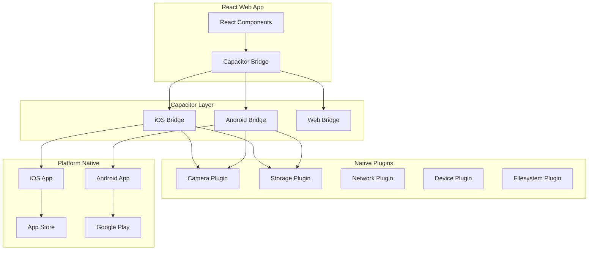

# 📱 Mobile Apps - AirPlus Aviation

<div align="center">

**Aplicações Móveis Nativas para iOS e Android**

[](https://capacitorjs.com/)
[](https://developer.apple.com/ios/)
[](https://developer.android.com/)
[](https://reactjs.org/)

</div>

## 📋 Índice

- [🎯 Visão Geral](#-visão-geral)
- [📱 Plataformas Suportadas](#-plataformas-suportadas)
- [🏗️ Arquitetura](#️-arquitetura)
- [📁 Estrutura](#-estrutura)
- [⚙️ Configuração](#️-configuração)
- [🔧 Desenvolvimento](#-desenvolvimento)
- [📦 Build e Deploy](#-build-e-deploy)
- [🧪 Testes](#-testes)
- [🚀 Publicação nas Stores](#-publicação-nas-stores)
- [🔄 Atualizações](#-atualizações)

## 🎯 Visão Geral

As aplicações móveis do AirPlus Aviation são construídas usando **Capacitor**, permitindo que o mesmo código React seja executado nativamente no iOS e Android. Oferecem funcionalidade completa offline e sincronização automática quando conectadas.

### ✨ Características Principais

- **📱 Aplicações Nativas** - Performance nativa real
- **🔄 Sincronização Offline** - Funciona sem internet
- **📸 Captura de Fotos** - Evidências fotográficas integradas
- **✍️ Assinaturas Digitais** - Canvas de assinatura touchscreen
- **📊 Dashboard Móvel** - Interface otimizada para mobile
- **🔔 Notificações Push** - Alertas em tempo real
- **📍 GPS Integration** - Localização para relatórios
- **🔒 Biometric Auth** - Touch ID / Face ID / Fingerprint
- **📤 Export/Share** - PDFs e relatórios nativos

## 📱 Plataformas Suportadas

### 🍎 iOS

- **Versão Mínima**: iOS 14.0+
- **Dispositivos**: iPhone, iPad
- **Arquiteturas**: arm64, x86_64 (simulador)
- **Funcionalidades**:
  - Face ID / Touch ID
  - Camera integration
  - Photo library access
  - Document sharing
  - Background sync

### 🤖 Android

- **API Mínima**: Android API 24 (Android 7.0)+
- **Dispositivos**: Smartphones e tablets
- **Arquiteturas**: arm64-v8a, armeabi-v7a
- **Funcionalidades**:
  - Fingerprint authentication
  - Camera integration
  - File system access
  - Share intents
  - Background tasks

## 🏗️ Arquitetura



### 🔄 Fluxo de Dados Mobile

1. **User Interaction** → React Components
2. **Capacitor Bridge** → Native API calls
3. **Native Plugins** → Platform-specific operations
4. **Local Storage** → Offline data persistence
5. **Sync Service** → Background synchronization
6. **Push Notifications** → Real-time updates

## 📁 Estrutura

```
mobile/
├── 📱 ios/                     # Projeto iOS nativo
│   └── App/
│       ├── App/
│       │   ├── AppDelegate.swift       # Configuração iOS
│       │   ├── Info.plist             # Metadados da app
│       │   ├── Assets.xcassets/       # Ícones e imagens
│       │   │   ├── AppIcon.appiconset/ # Ícones da app
│       │   │   └── Splash.imageset/   # Splash screen
│       │   └── Base.lproj/
│       ���       ├── LaunchScreen.storyboard # Launch screen
│       │       └── Main.storyboard         # Interface principal
│       ├── App.xcodeproj/             # Projeto Xcode
│       ├── App.xcworkspace/           # Workspace Xcode
│       └── Podfile                    # Dependências CocoaPods
│
├── 🤖 android/                 # Projeto Android nativo
│   ├── app/
│   │   ├── src/main/
│   │   │   ├── java/com/airplus/aviation/
│   │   │   │   └── MainActivity.java          # Activity principal
│   │   │   ├── res/                           # Recursos Android
│   │   │   │   ├── drawable*/                 # Imagens e ícones
│   │   │   │   ├── mipmap*/                   # Ícones da app
│   │   │   │   ├── layout/                    # Layouts XML
│   │   │   │   ├── values/                    # Valores e strings
│   │   │   │   └── xml/                       # Configurações XML
│   │   │   └── AndroidManifest.xml            # Manifesto Android
│   │   ├── build.gradle                       # Build script da app
│   │   └── capacitor.build.gradle             # Configuração Capacitor
│   ├─��� gradle/                                # Gradle wrapper
│   ├── build.gradle                           # Build script principal
│   ├── settings.gradle                        # Configurações Gradle
│   └── variables.gradle                       # Variáveis do projeto
│
├── 📄 capacitor.config.ts      # Configuração principal do Capacitor
├── 📄 package.json             # Dependências e scripts mobile
└── 📚 docs/                    # Documentação mobile
    ├── ios-setup.md            # Setup iOS
    ├── android-setup.md        # Setup Android
    ├── testing.md              # Guia de testes
    └── publishing.md           # Guia de publicação
```

## ⚙️ Configuração

### 📄 Capacitor Configuration

```typescript
// capacitor.config.ts
import { CapacitorConfig } from "@capacitor/cli";

const config: CapacitorConfig = {
  appId: "com.airplus.aviation",
  appName: "AirPlus Aviation",
  webDir: "dist/spa",
  server: {
    androidScheme: "https",
  },
  plugins: {
    Camera: {
      permissions: ["camera", "photos"],
    },
    Storage: {
      group: "AirPlusData",
    },
    PushNotifications: {
      presentationOptions: ["badge", "sound", "alert"],
    },
    LocalNotifications: {
      smallIcon: "ic_stat_icon",
      iconColor: "#00b0ea",
    },
  },
  ios: {
    scheme: "AirPlus Aviation",
  },
  android: {
    buildOptions: {
      keystorePath: "release.keystore",
      keystoreAlias: "airplus",
    },
  },
};

export default config;
```

### 🍎 iOS Configuration

```xml
<!-- ios/App/App/Info.plist -->
<key>NSCameraUsageDescription</key>
<string>AirPlus Aviation precisa de acesso à câmara para capturar evidências fotográficas dos formulários de limpeza e inspeção.</string>

<key>NSPhotoLibraryUsageDescription</key>
<string>AirPlus Aviation precisa de acesso à biblioteca de fotos para anexar imagens aos relatórios.</string>

<key>NSLocationWhenInUseUsageDescription</key>
<string>AirPlus Aviation usa a localização para identificar a posição durante as inspeções.</string>

<key>CFBundleVersion</key>
<string>1.0.0</string>

<key>CFBundleShortVersionString</key>
<string>1.0.0</string>
```

### 🤖 Android Configuration

```xml
<!-- android/app/src/main/AndroidManifest.xml -->
<uses-permission android:name="android.permission.CAMERA" />
<uses-permission android:name="android.permission.READ_EXTERNAL_STORAGE" />
<uses-permission android:name="android.permission.WRITE_EXTERNAL_STORAGE" />
<uses-permission android:name="android.permission.ACCESS_FINE_LOCATION" />
<uses-permission android:name="android.permission.INTERNET" />
<uses-permission android:name="android.permission.ACCESS_NETWORK_STATE" />

<application
    android:name="com.airplus.aviation.MainApplication"
    android:allowBackup="true"
    android:icon="@mipmap/ic_launcher"
    android:label="@string/app_name"
    android:theme="@style/AppTheme.NoActionBarLaunch">

    <activity
        android:name="com.airplus.aviation.MainActivity"
        android:theme="@style/AppTheme.NoActionBarLaunch"
        android:launchMode="singleTask"
        android:exported="true">
        <intent-filter>
            <action android:name="android.intent.action.MAIN" />
            <category android:name="android.intent.category.LAUNCHER" />
        </intent-filter>
    </activity>
</application>
```

## 🔧 Desenvolvimento

### 🚀 Setup Inicial

```bash
# Instalar dependências
npm install

# Build da aplicação web
npm run build:client

# Sincronizar com projetos nativos
npx cap sync

# Abrir no Xcode (iOS)
npx cap open ios

# Abrir no Android Studio (Android)
npx cap open android
```

### 📱 Desenvolvimento iOS

```bash
# Pré-requisitos
# - macOS 12+
# - Xcode 14+
# - CocoaPods instalado

# Setup do projeto iOS
cd ios/App
pod install

# Abrir no Xcode
npx cap open ios

# Live reload durante desenvolvimento
npx cap run ios --livereload --external

# Build para simulador
npx cap build ios

# Build para dispositivo
npx cap build ios --prod
```

### 🤖 Desenvolvimento Android

```bash
# Pré-requisitos
# - Android Studio 2022.3+
# - Android SDK API 24+
# - Java 11+

# Setup do projeto Android
npx cap sync android

# Abrir no Android Studio
npx cap open android

# Live reload durante desenvolvimento
npx cap run android --livereload --external

# Build debug
npx cap build android

# Build release
npx cap build android --prod
```

### 🔧 Scripts de Desenvolvimento

```bash
# Sincronizar código web com mobile
npm run mobile:sync

# Copiar assets para mobile
npm run mobile:copy

# Build completo para mobile
npm run build:mobile

# Executar em dispositivo iOS
npm run mobile:ios

# Executar em dispositivo Android
npm run mobile:android

# Validar sincronização mobile
npm run validate:mobile
```

## 📦 Build e Deploy

### 🏗️ Build Process

```bash
# 1. Build da aplicação web
npm run build:production

# 2. Copiar para projetos nativos
npx cap copy

# 3. Sincronizar plugins e configurações
npx cap sync

# 4. Build nativo
# iOS
npx cap build ios --prod

# Android
npx cap build android --prod --release
```

### 📱 Build Scripts Automatizados

```bash
# iOS
npm run build:ios
# Equivale a:
# - npm run build:production
# - npx cap copy ios
# - npx cap sync ios
# - cd ios && xcodebuild -workspace App.xcworkspace -scheme App -configuration Release

# Android
npm run build:android
# Equivale a:
# - npm run build:production
# - npx cap copy android
# - npx cap sync android
# - cd android && ./gradlew assembleRelease
```

### 🔐 Code Signing

#### iOS Code Signing

```bash
# Configurar certificados no Xcode
# 1. Abrir ios/App/App.xcworkspace
# 2. Selecionar target "App"
# 3. Ir para "Signing & Capabilities"
# 4. Configurar Team e Bundle Identifier
# 5. Escolher certificado de distribuição
```

#### Android Code Signing

```bash
# Gerar keystore (apenas uma vez)
keytool -genkey -v -keystore release.keystore -alias airplus -keyalg RSA -keysize 2048 -validity 10000

# Configurar no android/variables.gradle
# RELEASE_STORE_FILE=../release.keystore
# RELEASE_KEY_ALIAS=airplus
# RELEASE_STORE_PASSWORD=***
# RELEASE_KEY_PASSWORD=***
```

## 🧪 Testes

### 📱 Testes em Dispositivos

```bash
# iOS Simulator
npx cap run ios --target="iPhone 14 Pro"

# Android Emulator
npx cap run android --target="Pixel_7_API_33"

# Dispositivos físicos
npx cap run ios --list    # Listar dispositivos iOS
npx cap run android --list # Listar dispositivos Android
```

### 🔧 Testes de Funcionalidades

```typescript
// Exemplo: Teste de camera plugin
import { Camera, CameraResultType } from "@capacitor/camera";

const testCamera = async () => {
  try {
    const image = await Camera.getPhoto({
      quality: 90,
      allowEditing: false,
      resultType: CameraResultType.Uri,
    });

    console.log("Camera test successful:", image.webPath);
  } catch (error) {
    console.error("Camera test failed:", error);
  }
};
```

### 📊 Performance Testing

```bash
# Análise de performance iOS
# Usar Instruments no Xcode para:
# - Memory usage
# - CPU performance
# - Battery usage
# - Network activity

# Análise de performance Android
# Usar Android Studio Profiler para:
# - CPU profiling
# - Memory profiling
# - Network profiling
# - Energy profiling
```

## 🚀 Publicação nas Stores

### 🍎 App Store (iOS)

#### 1. Preparação

```bash
# Build de produção
npm run build:ios

# Archive no Xcode
# Product → Archive → Distribute App
```

#### 2. App Store Connect

- Criar app no App Store Connect
- Configurar metadados da app
- Upload de screenshots
- Definir preço e disponibilidade
- Submeter para review

#### 3. Informações da App

```
Nome da App: AirPlus Aviation
Bundle ID: com.airplus.aviation
Versão: 1.0.0
Categoria: Business
Classificação: 4+
```

### 🤖 Google Play (Android)

#### 1. Preparação

```bash
# Build de produção
npm run build:android

# APK/AAB gerado em:
# android/app/build/outputs/bundle/release/app-release.aab
```

#### 2. Google Play Console

- Criar app no Google Play Console
- Upload do AAB (Android App Bundle)
- Configurar listing da store
- Definir classificação etária
- Configurar pricing & distribution

#### 3. Informações da App

```
Nome da App: AirPlus Aviation
Package: com.airplus.aviation
Versão: 1 (1.0.0)
Categoria: Business
Target SDK: 34 (Android 14)
```

### 📋 Assets para Stores

#### Screenshots (ambas as stores)

- **iPhone**: 6.7", 6.5", 5.5"
- **iPad**: 12.9", 11"
- **Android Phone**: 16:9, 18:9
- **Android Tablet**: 10"

#### Ícones

- **iOS**: 1024x1024 (App Store)
- **Android**: 512x512 (Play Store)

#### Descrições

```
Título: AirPlus Aviation - Gestão Aeroportuária

Descrição Curta:
Sistema completo de gestão aeroportuária para operações de aviação comercial e privada.

Descrição Completa:
O AirPlus Aviation é uma solução completa de gestão aeroportuária desenvolvida especificamente para operações de aviação em Angola.

Características principais:
• Gestão completa de aeronaves
• Sistema de funcionários integrado
• Formulários digitais de limpeza
• Modo offline com sincronização
• Dashboard analytics em tempo real
• Captura de evidências fotográficas
• Assinaturas digitais
• Exportação de relatórios (PDF/Excel)
```

## 🔄 Atualizações

### 📲 Over-the-Air Updates

```typescript
// Configuração de live updates (opcional)
import { CapacitorUpdater } from "@capgo/capacitor-updater";

const checkForUpdates = async () => {
  try {
    const latest = await CapacitorUpdater.download({
      url: "https://api.airplus.ao/updates/latest",
    });

    if (latest) {
      await CapacitorUpdater.set({ id: latest.id });
      await CapacitorUpdater.reload();
    }
  } catch (error) {
    console.error("Update failed:", error);
  }
};
```

### 🔄 Processo de Atualização

1. **Desenvolvimento**

   ```bash
   # Incrementar versão
   npm version patch

   # Build e teste
   npm run build:mobile
   npm run test:mobile
   ```

2. **Deploy**

   ```bash
   # Build de produção
   npm run build:production

   # Upload para stores
   # iOS: Archive e upload via Xcode
   # Android: Upload AAB no Play Console
   ```

3. **Publicação**
   - **iOS**: Review da Apple (1-7 dias)
   - **Android**: Review do Google (1-3 dias)
   - **Rollout**: Publicação gradual (10% → 50% → 100%)

### 📊 Métricas de Adoção

```typescript
// Analytics de atualizações
import { FirebaseAnalytics } from "@capacitor-firebase/analytics";

const trackAppUpdate = async (version: string) => {
  await FirebaseAnalytics.logEvent({
    name: "app_update",
    parameters: {
      version: version,
      platform: Capacitor.getPlatform(),
      timestamp: new Date().toISOString(),
    },
  });
};
```

---

<div align="center">

**📱 Mobile Apps AirPlus Aviation**

_Aplicações nativas de alta performance para iOS e Android_

[⬅️ Voltar ao README principal](../README.md) • [📖 Guias Específicos](docs/)

</div>
