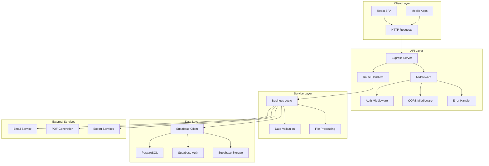

# 🔧 Backend - AirPlus Aviation API

<div align="center">

**API RESTful para Sistema de Gestão Aeroportuária**

[](https://nodejs.org/)
[](https://expressjs.com/)
[](https://www.typescriptlang.org/)
[](https://supabase.com/)

</div>

## 📋 Índice

- [🎯 Visão Geral](#-visão-geral)
- [🏗️ Arquitetura](#️-arquitetura)
- [📁 Estrutura](#-estrutura)
- [🔌 API Endpoints](#-api-endpoints)
- [🔐 Autenticação](#-autenticação)
- [💾 Base de Dados](#-base-de-dados)
- [⚙️ Configuração](#️-configuração)
- [🚀 Deploy](#-deploy)
- [🛠️ Desenvolvimento](#️-desenvolvimento)
- [📊 Monitorização](#-monitorização)

## 🎯 Visão Geral

O backend é uma **API RESTful** construída com Express.js e TypeScript, integrada com Supabase para base de dados e autenticação. Serve como ponte entre o frontend React e os dados, providenciando endpoints seguros e performantes.

### ✨ Características Principais

- **🔌 API RESTful** - Endpoints padronizados e documentados
- **🔐 Autenticação JWT** - Segurança baseada em tokens
- **💾 Supabase Integration** - Database-as-a-Service
- **📊 Real-time** - WebSocket support via Supabase
- **🔄 Sync Management** - Gestão de sincronização offline/online
- **⚡ Performance** - Caching e otimizações
- **📈 Logging** - Sistema completo de logs
- **🔒 Security** - Headers de segurança e validação

## 🏗️ Arquitetura



### 🔄 Request Lifecycle

1. **Request** → Express Server
2. **Middleware** → CORS, Auth, Validation
3. **Route Handler** → Business logic
4. **Service Layer** → Data processing
5. **Supabase** → Database operations
6. **Response** → JSON/File/Stream

## 📁 Estrutura

```
server/
├── 📄 index.ts                 # Configuração principal do servidor
├── 📄 node-build.ts            # Build configuration para Node.js
│
├── 🔌 routes/                  # Endpoints da API
│   ├── demo.ts                 # Endpoint de demonstração
│   ├── auth.ts                 # Autenticação e autorização
│   ├── aircraft.ts             # Gestão de aeronaves
│   ├── employees.ts            # Gestão de funcionários
│   ├── tasks.ts                # Gestão de tarefas
│   ├── cleaning-forms.ts       # Formulários de limpeza
│   ├── flight-sheets.ts        # Fichas de voo
│   ├── exports.ts              # Exportação de dados
│   ├── files.ts                # Upload/download de ficheiros
│   ├── sync.ts                 # Sincronização offline/online
│   └── system.ts               # Configurações do sistema
│
├── 🛡️ middleware/              # Middleware personalizado
│   ├── auth.ts                 # Autenticação JWT
│   ├── permissions.ts          # Verificação de permissões
│   ├── validation.ts           # Validação de dados
│   ├── rate-limit.ts           # Rate limiting
│   ├── cors.ts                 # Configuração CORS
│   └── error-handler.ts        # Tratamento de erros
│
├── 🔧 services/                # Lógica de negócio
│   ├── aircraft-service.ts     # Lógica de aeronaves
│   ├── employee-service.ts     # Lógica de funcionários
│   ├── task-service.ts         # Lógica de tarefas
│   ├── auth-service.ts         # Lógica de autenticação
│   ├── export-service.ts       # Lógica de exportação
│   ├── file-service.ts         # Lógica de ficheiros
│   ├── email-service.ts        # Envio de emails
│   ├── pdf-service.ts          # Geração de PDFs
│   └── sync-service.ts         # Lógica de sincronização
│
├── 📊 utils/                   # Utilitários
│   ├── database.ts             # Helpers da base de dados
│   ├── validation.ts           # Schemas de validação
│   ├── encryption.ts           # Funções de encriptação
│   ├── file-utils.ts           # Utilitários de ficheiros
│   ├── date-utils.ts           # Utilitários de datas
│   ���── response.ts             # Helpers de resposta
│
└── 📝 types/                   # Tipos TypeScript
    ├── api.ts                  # Tipos de API
    ├── auth.ts                 # Tipos de autenticação
    ├── database.ts             # Tipos da base de dados
    └── common.ts               # Tipos comuns
```

## 🔌 API Endpoints

### 🏠 Base URL
```
Development: http://localhost:8080/api
Production: https://airplus-aviation.netlify.app/api
```

### 🔐 Autenticação

#### POST /api/auth/login
```typescript
// Request
{
  "email": "usuario@airplus.ao",
  "password": "senha123"
}

// Response
{
  "success": true,
  "data": {
    "user": {
      "id": "uuid",
      "email": "usuario@airplus.ao",
      "name": "Nome Utilizador",
      "role": "admin"
    },
    "token": "jwt_token",
    "expiresAt": "2024-12-31T23:59:59Z"
  }
}
```

#### POST /api/auth/logout
```typescript
// Headers
Authorization: Bearer jwt_token

// Response
{
  "success": true,
  "message": "Logout realizado com sucesso"
}
```

#### GET /api/auth/me
```typescript
// Headers
Authorization: Bearer jwt_token

// Response
{
  "success": true,
  "data": {
    "id": "uuid",
    "email": "usuario@airplus.ao",
    "name": "Nome Utilizador",
    "role": "admin",
    "permissions": ["aircraft.read", "aircraft.write"]
  }
}
```

### ✈️ Aeronaves

#### GET /api/aircraft
```typescript
// Query Parameters
?page=1&limit=10&search=PT-ABC&status=active

// Response
{
  "success": true,
  "data": {
    "aircraft": [
      {
        "id": "uuid",
        "registration": "PT-ABC",
        "model": "Boeing 737",
        "status": "active",
        "lastMaintenance": "2024-01-15T10:00:00Z"
      }
    ],
    "pagination": {
      "page": 1,
      "limit": 10,
      "total": 25,
      "totalPages": 3
    }
  }
}
```

#### POST /api/aircraft
```typescript
// Request
{
  "registration": "PT-XYZ",
  "model": "Airbus A320",
  "manufacturer": "Airbus",
  "yearManufactured": 2020,
  "capacity": 180,
  "status": "active"
}

// Response
{
  "success": true,
  "data": {
    "id": "uuid",
    "registration": "PT-XYZ",
    "model": "Airbus A320",
    "createdAt": "2024-01-20T10:00:00Z"
  }
}
```

### 👥 Funcionários

#### GET /api/employees
```typescript
// Response
{
  "success": true,
  "data": [
    {
      "id": "uuid",
      "name": "João Silva",
      "email": "joao@airplus.ao",
      "position": "Técnico de Manutenção",
      "department": "Manutenção",
      "certifications": ["cert1", "cert2"],
      "status": "active"
    }
  ]
}
```

#### POST /api/employees
```typescript
// Request
{
  "name": "Maria Santos",
  "email": "maria@airplus.ao",
  "position": "Piloto",
  "department": "Operações",
  "phone": "+244900000000",
  "certifications": ["CPL", "ATPL"]
}
```

### 🧽 Formulários de Limpeza

#### GET /api/cleaning-forms
```typescript
// Response
{
  "success": true,
  "data": [
    {
      "id": "uuid",
      "aircraftId": "uuid",
      "aircraftRegistration": "PT-ABC",
      "status": "completed",
      "assignedEmployees": ["uuid1", "uuid2"],
      "startedAt": "2024-01-20T08:00:00Z",
      "completedAt": "2024-01-20T10:00:00Z",
      "tasks": [
        {
          "id": "uuid",
          "name": "Limpeza Interior",
          "completed": true,
          "photoEvidence": ["photo1.jpg"],
          "signature": "signature_data"
        }
      ]
    }
  ]
}
```

### 📊 Exportações

#### POST /api/exports/pdf
```typescript
// Request
{
  "type": "cleaning-forms",
  "filters": {
    "startDate": "2024-01-01",
    "endDate": "2024-01-31",
    "aircraftId": "uuid"
  },
  "format": "pdf"
}

// Response (Stream)
Content-Type: application/pdf
Content-Disposition: attachment; filename="cleaning-forms-2024-01.pdf"
```

### 📁 Gestão de Ficheiros

#### POST /api/files/upload
```typescript
// FormData
file: File
type: "photo" | "document" | "signature"
entityId: "uuid"
entityType: "aircraft" | "employee" | "cleaning-form"

// Response
{
  "success": true,
  "data": {
    "id": "uuid",
    "filename": "photo.jpg",
    "url": "https://storage.supabase.co/...",
    "size": 1024000,
    "mimeType": "image/jpeg"
  }
}
```

### 🔄 Sincronização

#### POST /api/sync/upload
```typescript
// Request
{
  "data": {
    "aircraft": [...],
    "employees": [...],
    "cleaningForms": [...]
  },
  "lastSyncAt": "2024-01-20T10:00:00Z"
}

// Response
{
  "success": true,
  "data": {
    "conflicts": [],
    "synced": {
      "aircraft": 5,
      "employees": 2,
      "cleaningForms": 10
    },
    "syncedAt": "2024-01-20T12:00:00Z"
  }
}
```

#### GET /api/sync/download
```typescript
// Query Parameters
?lastSyncAt=2024-01-20T10:00:00Z

// Response
{
  "success": true,
  "data": {
    "aircraft": [...],
    "employees": [...],
    "cleaningForms": [...],
    "deletedIds": {
      "aircraft": ["uuid1"],
      "employees": [],
      "cleaningForms": ["uuid2"]
    },
    "syncedAt": "2024-01-20T12:00:00Z"
  }
}
```

## 🔐 Autenticação

### 🎫 JWT Tokens
```typescript
// Token Structure
{
  "sub": "user_id",
  "email": "user@example.com",
  "role": "admin",
  "permissions": ["aircraft.read", "aircraft.write"],
  "iat": 1640995200,
  "exp": 1641081600
}
```

### 🛡️ Middleware de Autenticação
```typescript
// Uso em rotas protegidas
app.get('/api/aircraft', 
  authMiddleware,           // Verificar token JWT
  permissionMiddleware(['aircraft.read']), // Verificar permissões
  getAircraftHandler       // Handler da rota
);
```

### 🔑 Níveis de Acesso
- **Super Admin** - Acesso total ao sistema
- **Admin** - Gestão de dados e utilizadores
- **Manager** - Supervisão de operações
- **Supervisor** - Gestão de equipas
- **Technician** - Execução de tarefas
- **Operator** - Operações básicas
- **Client** - Visualização limitada
- **Viewer** - Apenas leitura

## 💾 Base de Dados

### 🐘 PostgreSQL via Supabase
```typescript
// Cliente Supabase
import { createClient } from '@supabase/supabase-js';

const supabase = createClient(
  process.env.SUPABASE_URL!,
  process.env.SUPABASE_SERVICE_KEY!
);
```

### 📊 Operações CRUD
```typescript
// Example: Aircraft Service
class AircraftService {
  async getAll(filters: AircraftFilters) {
    let query = supabase
      .from('aircraft')
      .select('*');
    
    if (filters.status) {
      query = query.eq('status', filters.status);
    }
    
    if (filters.search) {
      query = query.ilike('registration', `%${filters.search}%`);
    }
    
    const { data, error } = await query;
    if (error) throw error;
    
    return data;
  }
  
  async create(aircraft: CreateAircraftDto) {
    const { data, error } = await supabase
      .from('aircraft')
      .insert(aircraft)
      .select()
      .single();
    
    if (error) throw error;
    return data;
  }
}
```

### 🔄 Real-time Subscriptions
```typescript
// Real-time updates
const subscription = supabase
  .channel('aircraft-changes')
  .on('postgres_changes', 
    { 
      event: '*', 
      schema: 'public', 
      table: 'aircraft' 
    },
    (payload) => {
      // Broadcast changes to clients
      io.emit('aircraft-updated', payload);
    }
  )
  .subscribe();
```

## ⚙️ Configuração

### 🌍 Variáveis de Ambiente
```env
# Server Configuration
PORT=8080
NODE_ENV=production

# Supabase Configuration
SUPABASE_URL=https://your-project.supabase.co
SUPABASE_SERVICE_KEY=your-service-key
SUPABASE_ANON_KEY=your-anon-key

# JWT Configuration
JWT_SECRET=your-jwt-secret
JWT_EXPIRATION=24h

# File Upload
MAX_FILE_SIZE=10485760  # 10MB
UPLOAD_DIR=./uploads

# Email Service
EMAIL_SERVICE=sendgrid
EMAIL_API_KEY=your-api-key
FROM_EMAIL=noreply@airplus.ao

# Rate Limiting
RATE_LIMIT_WINDOW=15  # 15 minutes
RATE_LIMIT_MAX=100    # 100 requests per window
```

### 🔧 Configuração do Servidor
```typescript
// server/index.ts
import express from 'express';
import cors from 'cors';
import helmet from 'helmet';
import compression from 'compression';

const app = express();

// Security middleware
app.use(helmet());
app.use(cors());
app.use(compression());

// Body parsing
app.use(express.json({ limit: '10mb' }));
app.use(express.urlencoded({ extended: true }));

// API routes
app.use('/api', apiRoutes);

// Error handling
app.use(errorHandler);

const PORT = process.env.PORT || 8080;
app.listen(PORT, () => {
  console.log(`🚀 Server running on port ${PORT}`);
});
```

## 🚀 Deploy

### 🌐 Netlify Functions (Serverless)
```typescript
// netlify/functions/api.ts
import { Handler } from '@netlify/functions';
import serverless from 'serverless-http';
import { app } from '../../server/index';

const handler: Handler = serverless(app);

export { handler };
```

### 🐳 Docker (Alternativo)
```dockerfile
# Dockerfile
FROM node:18-alpine

WORKDIR /app

COPY package*.json ./
RUN npm ci --only=production

COPY dist/ ./dist/
COPY public/ ./public/

EXPOSE 8080

CMD ["node", "dist/server/node-build.mjs"]
```

### ☁️ Deploy Commands
```bash
# Netlify deploy
npm run build
netlify deploy --prod

# Traditional server
npm run build
npm start

# Docker deploy
docker build -t airplus-api .
docker run -p 8080:8080 airplus-api
```

## 🛠️ Desenvolvimento

### 🚀 Scripts de Desenvolvimento
```bash
# Iniciar servidor de desenvolvimento
npm run dev

# Build para produção
npm run build:server

# Verificação de tipos
npm run typecheck

# Testes
npm test

# Linting
npm run lint
```

### 🧪 Testes
```typescript
// Example: Aircraft API tests
describe('Aircraft API', () => {
  test('GET /api/aircraft should return aircraft list', async () => {
    const response = await request(app)
      .get('/api/aircraft')
      .set('Authorization', `Bearer ${token}`)
      .expect(200);
    
    expect(response.body.success).toBe(true);
    expect(response.body.data).toBeInstanceOf(Array);
  });
  
  test('POST /api/aircraft should create new aircraft', async () => {
    const aircraftData = {
      registration: 'PT-TEST',
      model: 'Test Aircraft',
      manufacturer: 'Test Co'
    };
    
    const response = await request(app)
      .post('/api/aircraft')
      .set('Authorization', `Bearer ${token}`)
      .send(aircraftData)
      .expect(201);
    
    expect(response.body.data.registration).toBe('PT-TEST');
  });
});
```

### 📝 Logging
```typescript
// Logger configuration
import winston from 'winston';

const logger = winston.createLogger({
  level: 'info',
  format: winston.format.combine(
    winston.format.timestamp(),
    winston.format.errors({ stack: true }),
    winston.format.json()
  ),
  transports: [
    new winston.transports.File({ filename: 'error.log', level: 'error' }),
    new winston.transports.File({ filename: 'combined.log' }),
    new winston.transports.Console()
  ]
});

// Usage
logger.info('Server started', { port: PORT });
logger.error('Database connection failed', { error: error.message });
```

## 📊 Monitorização

### 📈 Métricas de Performance
- **Response Time**: Tempo médio de resposta
- **Throughput**: Requests por segundo
- **Error Rate**: Taxa de erros
- **Database Queries**: Performance das queries

### 🔍 Health Checks
```typescript
// GET /api/health
app.get('/api/health', async (req, res) => {
  try {
    // Check database connection
    const { error } = await supabase
      .from('system_settings')
      .select('id')
      .limit(1);
    
    if (error) throw error;
    
    res.json({
      status: 'healthy',
      timestamp: new Date().toISOString(),
      uptime: process.uptime(),
      memory: process.memoryUsage(),
      database: 'connected'
    });
  } catch (error) {
    res.status(500).json({
      status: 'unhealthy',
      error: error.message
    });
  }
});
```

### 📊 Analytics
- **User Activity**: Logs de atividade dos utilizadores
- **API Usage**: Estatísticas de uso da API
- **Error Tracking**: Registo e análise de erros
- **Performance Monitoring**: Monitorização contínua

---

<div align="center">

**🔧 Backend AirPlus Aviation**

*API robusta e escalável para gestão aeroportuária*

[⬅️ Voltar ao README principal](../README.md)

</div>
